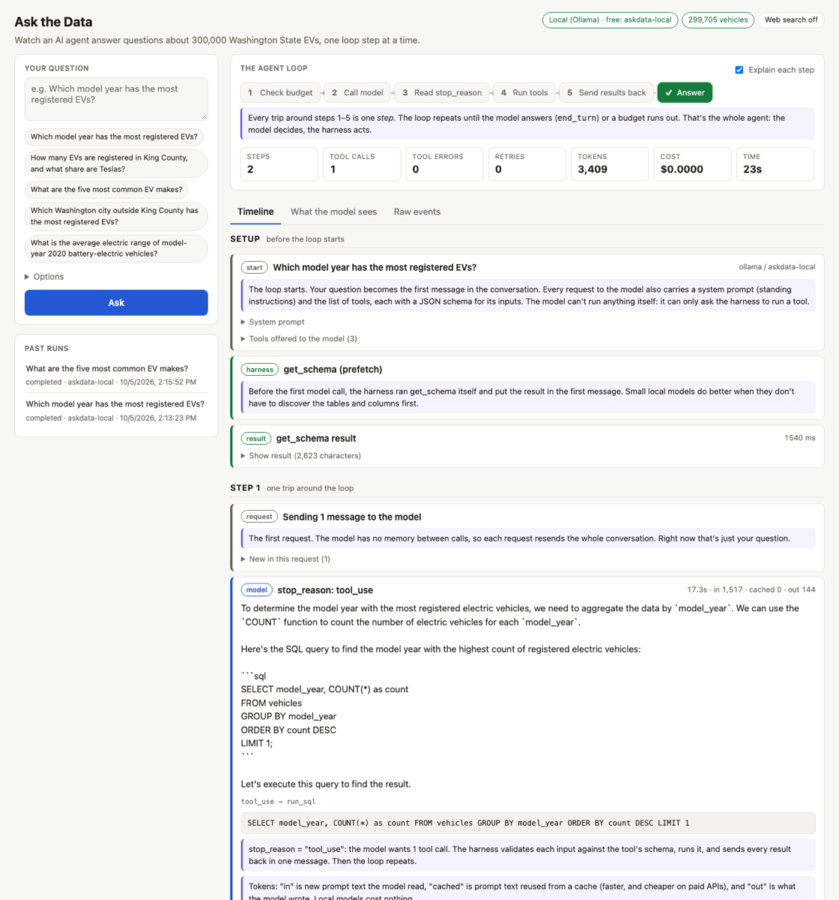

# Ask the Data: an AI agent that uses real tools, with the loop on display

Ask the Data is a multi-step AI agent that answers questions about the roughly 300,000 electric vehicles registered in Washington State. You ask a question in plain English. The agent decides what to do, asks for tools to be run (it can read the database's layout, run SQL queries, run Python in a sandbox, and search the web), reads the results, fixes its own mistakes, and repeats until it can answer. Every step is recorded, so you can see exactly what it did and why.

**It's free to run.** By default a small open-weight model (Qwen 2.5 3B via [Ollama](https://ollama.com)) runs on your own computer. No account, API key, or payment is needed. If you have an Anthropic API key, one setting switches to **Claude** for much better answers.

**The point is the loop, not a framework.** The agent loop is [`agent/loop.py`](agent/loop.py), about 270 lines that talk to the model API directly. Around it are the parts a production agent needs: errors sorted by who should handle them, automatic retries, hard limits on steps, time and cost, a guard against repeated calls, fault injection to prove the retries work, a complete trace of every step, offline replay, and an evaluation suite that measures how often the answers are right.

| | |
|---|---|
| **Web app** | Streams each step of the loop as it happens and explains it in plain English: what the model was sent, what it decided, which tools ran, what failed and why, and the final answer. A "What the model sees" view shows the full conversation the model receives on each request. |
| **Command line** | Ask questions, view a run as an HTML page, replay a run offline, and run the evals. |
| **Evals** | 20 test questions whose correct answers are computed from the data itself, graded automatically, with a report of accuracy, steps, time, and cost. |



---

## Quick start

These are macOS commands, run from the project root; see [Setup](#setup) for details, Linux, and [Windows](#setup-on-windows). Everything is free: no account or API key needed.

**First time** (*roughly 10–20 minutes, an estimate*: mostly the 2 GB model download):

```bash
brew install python ollama
brew services start ollama
python3 -m venv .venv && source .venv/bin/activate
pip install -e '.[dev]'
askdata load-data        # download the vehicle data and build the database (~70 MB)
askdata setup-local      # download the free model (~2 GB) and set it up for this project
askdata serve            # opens http://127.0.0.1:8000
```

**Coming back later** (everything is already built):

```bash
brew services start ollama          # skip if it's already running
source .venv/bin/activate
askdata serve                       # opens http://127.0.0.1:8000
```

**What you'll see:** a page with a question box and example questions. Ask one, and the agent's steps appear one by one over about 20 seconds, each with a short explanation. A loop diagram at the top highlights the stage the agent is in. When you're done, press **Ctrl+C**, then see [Turning everything off](#turning-everything-off) to stop the background service.

---

## Contents

- [Quick start](#quick-start)
- [Key ideas in plain English](#key-ideas-in-plain-english)
- [Results](#results)
- [How it works](#how-it-works)
- [Tech stack](#tech-stack)
- [Setup](#setup)
- [Running it](#running-it)
- [How long things take](#how-long-things-take)
- [Choosing the model: Ollama or Claude](#choosing-the-model-ollama-or-claude)
- [Turning everything off](#turning-everything-off)
- [How the evals work](#how-the-evals-work)
- [Code guide](#code-guide)
- [Design decisions and lessons learned](#design-decisions-and-lessons-learned)
- [How the design evolved](#how-the-design-evolved)
- [Known limitations and next steps](#known-limitations-and-next-steps)
- [Data and licensing](#data-and-licensing)
- [How this project was built](#how-this-project-was-built)

---

## Key ideas in plain English

A few terms come up throughout this README. None of them require a technical background.

- **Agent.** A program where an AI model decides what to do next, step by step, instead of following a fixed script. Here, the model decides which query to run, reads the result, and decides whether it needs another one.

- **Tool.** Something the agent can ask to have done for it. This project has four: **get_schema** (describe the database's tables and columns), **run_sql** (run a database query), **run_python** (run a short Python program), and **web_search** (search the web, optional). Each tool comes with a **schema**: a precise description of the inputs it accepts, so the model knows how to ask for it.

- **The model can't do anything by itself.** It only writes text. When it wants a tool, it writes a structured request ("run_sql with this query"), and the program around it actually runs the tool and sends back the result. That surrounding program is called the **harness**. The model decides; the harness acts.

- **The loop.** The harness repeats one cycle until the model is done:
  1. Check that there's budget left (steps, time, tokens, money).
  2. Send the conversation to the model.
  3. Read why the model stopped: it either wants tools (`stop_reason: tool_use`) or has finished (`stop_reason: end_turn`).
  4. Run the tools it asked for.
  5. Send the results back, and go to step 1.

  Each trip around the loop is one **step**. Most questions here take 2–4 steps.

- **The model has no memory.** Every request resends the whole conversation: the instructions, your question, the model's earlier replies, and every tool result so far. The web app's "What the model sees" view shows exactly this.

- **Three kinds of failure, three owners.** Things go wrong, and who should deal with it depends on what went wrong:
  - **Temporary failures** (a service is busy, a network hiccup) are retried automatically by the harness. The model never hears about them unless retrying doesn't help.
  - **Mistakes the model can fix** (a misspelled column name, a Python error) are sent back to the model marked as errors, so it can correct itself on the next step. This is what makes an agent able to recover.
  - **Fatal problems** (no API key, a budget used up) stop the run with a clear status.

- **Retries with backoff.** When something fails temporarily, the harness waits and tries again, waiting longer each time (up to 1 second, then up to 2, then up to 4…), with a random amount chosen within that range so many clients don't all retry at once. That's called **exponential backoff with jitter**.

- **Budgets and the loop guard.** Every run has limits: at most 12 steps, 5 minutes, 400,000 tokens, and $0.50 by default. On the last allowed step, the model is told to answer with what it has. A **loop guard** stops the model from making the exact same tool call over and over.

- **Trace.** A log of every event in a run: each request, response, tool call, result, retry, and decision, written as it happens. From a trace you can draw the run as a web page, or **replay** it: run the real loop again with the model's responses and the tool results played back from the log, to check the program still behaves the same.

- **Chaos mode.** A setting that makes tool calls fail at random, on purpose, to show that the retry logic really works.

- **Context window.** The most text a model can read at once. Local models are often set up with a small one, and when a conversation outgrows it, the start is silently cut off. This project sets the local model's window to 16,384 tokens (about 12,000 words) and warns when a run gets close.

- **Schema prefetch.** Small models often guess table and column names instead of looking them up. With prefetch on (the default for local models), the harness looks up the database layout itself and includes it with your question, so the model starts with the right names.

- **Evals.** A fixed set of test questions with known correct answers, graded automatically, so that "it seems to work" becomes a number you can track.

---

## Results

Measured on October 5, 2026, on an 8 GB Apple M1 MacBook Air, with the free local model (**Qwen 2.5 3B** via Ollama) and **schema prefetch off** (prefetch was added after this run). 17 of the 20 questions ran; the 3 web-search questions were skipped because no search key was set. Reproduce with `askdata eval --no-prefetch-schema`.

> **How to read this table**
>
> - **Result:** ✅ means the answer contained the correct value. ❌ means it didn't.
> - **Status:** how the run ended. `completed` means the model gave an answer (right or wrong). `aborted` means the loop guard stopped it for repeating itself. `out of time` means it hit the time limit.
> - **Steps:** trips around the loop. **Time:** seconds the run took.
> - **What went wrong:** what the trace shows. Every run's trace is saved, so each of these can be checked step by step.

| Question | Tag | Result | Status | Steps | Time | What went wrong |
|---|---|---|---|---|---|---|
| How many EVs are in the dataset? | db | ❌ | completed | 2 | 4s | Guessed a table name, then said it would check the schema and stopped |
| What % of EVs are Teslas? | db | ❌ | completed | 3 | 26s | Wrote its SQL in the answer text instead of running it |
| Five most common makes | db | ✅ | completed | 3 | 15s | Read the answer off the schema's "most common values" list |
| BEVs per PHEV in King County | db | ❌ | aborted | 4 | 300s | Repeated a failing call until the loop guard stopped it |
| Average range of 2020 BEVs | db | ❌ | completed | 2 | 8s | Answered 235.8 miles; correct is 277.1 (it didn't exclude unknown ranges) |
| Top city outside King County | db | ✅ | completed | 4 | 18s | Correct city, but its "evidence" misquoted the SQL it ran (see below) |
| County with highest PHEV share | db | ❌ | completed | 4 | 41s | Named the wrong county |
| Model year with most EVs | db | ✅ | completed | 4 | 17s | Guessed a column, read the error, checked the schema, fixed it |
| Number of manufacturers | db | ❌ | completed | 3 | 14s | Answer had no number |
| Vehicles registered out of state | db | ❌ | completed | 3 | 15s | Answer had no number |
| % eligible as clean-fuel vehicles | db | ❌ | completed | 5 | 44s | Wrong percentage |
| Top 3 models for 2024 | db | ❌ | completed | 3 | 15s | Named one of the three |
| EVs in Seattle City Light territory | db | ❌ | completed | 4 | 22s | Answered 172,316; correct is 48,889 (wrong utility match) |
| % with unknown range | db | ❌ | completed | 2 | 8s | Wrong percentage |
| Biggest year-over-year growth | python | ❌ | completed | 4 | 119s | Guessed a column that doesn't exist |
| County BEV share vs. range correlation | python | ❌ | out of time | 4 | 339s | Ran past the 240 s limit (a bug, since fixed; see below) |
| Median Tesla Model 3 range | python | ❌ | completed | 3 | 44s | Wrong value |

**Overall: 3 of 17 correct (18%).** Database-only questions: 3 of 14. Questions needing Python: 0 of 3. Median 3 steps and 18 seconds per question. Cost: $0.

**What this means:** the harness works. Every run ended cleanly with a status, errors went back to the model, the loop guard stopped a runaway run, and every step was recorded. **The 3B model is the weak link.** The most common failures are the ones small models are known for: guessing table and column names, announcing a plan and then stopping without acting, and answering without the number it was asked for. Those failures led to the schema prefetch feature, which is now on by default for local models.

**Two things the traces caught that a pass/fail score can't:**

- **A pass that was only partly right.** For "top city outside King County", the answer (Vancouver) passed. But the trace shows the SQL the model actually ran only counted battery-electric vehicles, while the "Evidence" section of its answer quoted a different query without that filter. The count it gave was for battery-electric vehicles only.
- **A harness bug.** The correlation question ran for 339 seconds against a 240-second limit. The trace showed why: the time limit was only checked between model calls, so one slow call could run past it and then be retried. Each model call now gets only the time remaining (see [design decisions](#design-decisions-and-lessons-learned)).

**Measurements since the eval** (single runs, not a full eval, so treat them as examples rather than scores):

| What | Result |
|---|---|
| "Which model year has the most registered EVs?" with schema prefetch on | Correct in **2 steps, 22.5 s** (the eval run without prefetch took 4 steps, including a failed guess) |
| Four questions asked through the web app with prefetch on | All completed in 2–3 steps, 19–23 s each |
| Qwen 3.5 4B (a newer model) on the same 8 GB laptop | Wrote correct SQL, but with ordinary apps open the laptop was swapping and generation ran at **about 1 token per second** (65–93 s for a single step). Too slow for this machine; recommended for 16 GB or more. |

**Not yet measured:** a full eval with schema prefetch on, and any run with Claude (no Anthropic API key was used during development). Both are one command each; see [How the evals work](#how-the-evals-work).

---

## How it works

In short:

```text
Once, at setup:    download the vehicle data → load it into a SQLite database → set up the local model
For each question: question → model → tools → model → tools → … → answer   (every event goes to a trace)
```

Step by step:

**1. Data.** `askdata load-data` downloads the Washington State Department of Licensing's *Electric Vehicle Population Data* (about 300,000 rows) and loads it into a SQLite table called `vehicles`. It also stores a plain-English description of every column in the database, such as "electric_range = 0 means the range hasn't been researched, not zero miles", so the model can read it.

**2. Setup.** Your question becomes the first message. The harness also sends standing instructions (the **system prompt**) and the list of tools with their input schemas. With a local model, it first runs `get_schema` itself and includes the result (schema prefetch).

**3. The model decides.** The model replies with text, tool requests, or both, and a `stop_reason` saying which. The reply is added to the conversation unchanged.

**4. The harness acts.** For each tool request, the **tool registry** (`agent/tools/base.py`) looks the tool up, checks the input against its schema, runs it, retries temporary failures, and sorts any failure into one of the three kinds above. Every request gets a result, even if it failed, and all results go back to the model together in one message.

- **run_sql** opens the database read-only three separate ways, so no query can change it, and cancels queries that run longer than 10 seconds.
- **run_python** runs code in a separate process with none of your environment variables (so no API keys), with limits on CPU time and file size, and a 30-second timeout. On macOS it also runs under `sandbox-exec`, which blocks network access and stops it from writing outside its own folder.
- **web_search** (optional) uses the Tavily search API and labels results as untrusted, so the model treats them as evidence, not instructions.

**5. Guardrails.** Before each model call the harness checks the budgets, and each call only gets the time that's left. A loop guard blocks the third identical tool call and stops the run on the fifth. On the last allowed step, the model is told to answer now.

**6. Trace.** Every event is written to `runs/<run_id>.jsonl` the moment it happens, and also sent to anyone listening: the command line prints one line per event, and the web app streams them to your browser.

**7. Answer.** When the model stops with `end_turn`, its text is the answer, and the run ends with a status and totals for steps, tokens, cost and time.

Two model providers sit behind one small interface (`agent/llm.py`): **Ollama** (local, free, the default) and **Claude** (paid). Ollama speaks the same API format as Claude, so the loop, tools, traces, and replay are identical for both.

---

## Tech stack

| Layer | Tool | Why |
|---|---|---|
| Language | **Python 3.11+** (developed on 3.14) | One language for the agent, tools, server, and evals |
| Agent loop | Hand-written, on the **Anthropic Python SDK** (`client.beta.messages.create`) | The point of the project is to show the loop; no agent framework or tool runner |
| Local model (default) | **Qwen 2.5 3B** via **Ollama**, with a 16k context window | Free, offline, fits in 8 GB of RAM, and supports tool calling |
| Claude (optional) | **Claude Sonnet 5.5** by default, any Claude model by flag | Much stronger answers; adaptive thinking, prompt caching, and refusal fallback are turned on |
| Database | **SQLite**, opened read-only | Built into Python; no server to install |
| Tool inputs | **Pydantic** models | One definition gives both the JSON schema sent to the model and the validation of what comes back |
| Python sandbox | Subprocess + resource limits + macOS **sandbox-exec** | Real isolation from the network and secrets without Docker |
| Web search (optional) | **Tavily** API via **httpx** | Simple search API with a free tier |
| Web app | **FastAPI** + **Server-Sent Events**, one page of plain HTML, CSS, and JavaScript | Same language as the agent, and no build step; see [design decisions](#design-decisions-and-lessons-learned) |
| Tests | **pytest** (111 tests) and **Playwright** (14 browser tests of the web app, in headless Chromium) | Fast, offline tests for the agent, plus tests that click through the real page; none need a network, Ollama, or an API key |

---

## Setup

These steps are written for macOS with Homebrew, with Linux equivalents noted. **Windows users:** see [Setup on Windows](#setup-on-windows) below.

### 1. Prerequisites

| Need | macOS | Linux (Debian/Ubuntu) |
|---|---|---|
| Python ≥ 3.11 | `brew install python` | `apt install python3 python3-venv` (check `python3 --version`) |
| Ollama (free, runs the model) | `brew install ollama && brew services start ollama` | `curl -fsSL https://ollama.com/install.sh \| sh` (sets up a background service) |
| A web browser | any | any |
| *Optional:* Anthropic API key, only to use Claude | [console.anthropic.com](https://console.anthropic.com) | same |
| *Optional:* Tavily API key, only for web search | [tavily.com](https://tavily.com) (free tier) | same |

**Hardware.** Everything was developed and measured on an 8 GB M1 MacBook Air. The default model is a 1.9 GB download and uses about 2.3 GB of memory while it runs. With 16 GB or more you can use a larger, better model; see [Other combinations](#other-combinations).

**Linux note:** everything works the same except the Python sandbox's network and file isolation, which uses a macOS feature. On Linux, `run_python` still runs in a separate process with no secrets and with resource limits, but it can reach the network.

### 2. Install

```bash
git clone https://github.com/PaulCornell/mytooluse.git && cd mytooluse

python3 -m venv .venv
source .venv/bin/activate          # do this in every new terminal, or use .venv/bin/askdata
pip install -e '.[dev]'            # the agent, the web app, and the test tools (~70 MB)
```

**Optional, for the browser tests of the web app:**

```bash
pip install -e '.[e2e]'            # Playwright and its pytest plugin
playwright install chromium        # a test copy of Chromium (~560 MB, shared by all Playwright projects)
```

Without these, `pytest` runs everything except the browser tests.

### 3. Configure

All settings have working defaults. **Nothing is required**: the defaults use the free local model.

| Variable | Default | Purpose |
|---|---|---|
| `ASKDATA_PROVIDER` | `ollama` | Which model answers: `ollama` (free, local) or `anthropic` (Claude; needs a key) |
| `OLLAMA_HOST` | `http://localhost:11434` | Where Ollama is listening |
| `ANTHROPIC_API_KEY` | none | Only needed for `anthropic` |
| `TAVILY_API_KEY` | none | Turns on the `web_search` tool. Without it, the tool isn't offered to the model. |

Most other choices are command-line flags: `--model`, `--max-steps` (12), `--max-time` (300 s), `--max-cost` ($0.50), `--chaos`, `--seed`, `--prefetch-schema` / `--no-prefetch-schema`, and `--db` (`data/ev.db`). Run `askdata ask --help` for the full list.

### 4. Build the data and the model

```bash
askdata load-data        # download the CSV and build data/ev.db
askdata setup-local      # pull qwen2.5:3b and create askdata-local with a 16k context window
pytest                   # optional: about 3 seconds, or about 12 with the browser tests
```

| Step | Command | Time (8 GB M1) |
|---|---|---|
| Download the vehicle data (~70 MB) | part of `askdata load-data` | *under a minute on a fast connection (estimate)* |
| Build the database (~105 MB) | part of `askdata load-data` | **about 6 seconds (measured)** |
| Download the model (1.9 GB) | part of `askdata setup-local` | *a few minutes (estimate)* |
| Create `askdata-local` from it | part of `askdata setup-local` | **seconds (measured)** |

`askdata setup-local` exists because Ollama often loads models with a 4,096-token context window and silently drops the start of longer conversations. It creates a copy of the model called `askdata-local` with a 16,384-token window. The same definition is in [`ollama/Modelfile`](ollama/Modelfile) if you'd rather run `ollama create` yourself.

### Setup on Windows

> **Not tested on Windows.** The project was built and measured on macOS. The steps below use standard Windows tooling, but expect to adapt a step or two.

**Option A, recommended: WSL 2 (Linux inside Windows).** This avoids nearly all Windows-specific issues.

1. In PowerShell **as Administrator**: `wsl --install`, then restart. This installs Ubuntu.
2. Open the **Ubuntu** app and follow the Linux instructions above, cloning the repo inside Ubuntu (for example `~/mytooluse`, not under `/mnt/c/`, which is much slower).
3. Install Ollama **inside Ubuntu** (`curl -fsSL https://ollama.com/install.sh | sh`) so that `askdata setup-local` can find the `ollama` command.
4. Run `askdata serve --no-browser`, then open http://127.0.0.1:8000 in your normal Windows browser; WSL forwards the port.

**Option B: native Windows (PowerShell).**

> **Known gap:** the `run_python` tool uses Python's `resource` module to set CPU and file limits, and that module doesn't exist on Windows. Natively, every `run_python` call fails, and the model is told so. Everything else should work. Use WSL for the full experience.

1. **Install the tools** with `winget`, which is built into Windows 10/11:
   ```powershell
   winget install Python.Python.3.12
   winget install Ollama.Ollama
   ```
   Open a **new** PowerShell window afterwards so the new commands are on your `PATH`.

2. **Install the project:**
   ```powershell
   git clone https://github.com/PaulCornell/mytooluse.git; cd mytooluse
   py -3.12 -m venv .venv
   .venv\Scripts\Activate.ps1
   pip install -e '.[dev]'
   askdata load-data
   askdata setup-local          # Ollama for Windows runs in the background after install
   ```

3. **Run** with the same commands as macOS: `askdata serve`. Environment variables use PowerShell syntax: `$env:NAME = "value"`.

---

## Running it

> **Start Ollama first.** The agent needs Ollama running to use the local model. Homebrew starts it at login unless you stopped it, for example with the steps in [Turning everything off](#turning-everything-off). To check and start it:
>
> ```bash
> brew services list | grep ollama        # should say "started"
> brew services start ollama              # if not
> ```
>
> Without Ollama, the web app still opens and shows how to start it, and the tests, replay, and trace viewer all work. On Windows, start Ollama from the Start menu.

### Web app

```bash
askdata serve                     # http://127.0.0.1:8000, opens a browser tab
askdata serve --port 8001         # a different port
askdata serve --no-browser        # don't open a tab
```

The page has:

- **The agent loop** diagram, which highlights the current stage, and a stats bar (steps, tool calls, errors, retries, tokens, cost, time).
- **Timeline:** every event as it happens, with SQL results shown as tables. With **Explain each step** on (the default), each event says what happened, why, and what the loop does next.
- **What the model sees:** the exact conversation sent on each request.
- **Raw events:** the trace as JSON.
- **Options:** model provider, model, step and time limits, schema prefetch, chaos level, and a chaos seed (the same seed gives the same failures every time).
- **Past runs:** reopen any earlier run. Every run also has its own link (`/#run=<id>`).

The server only accepts connections from your own computer, because runs can execute Python. It refuses requests from other websites, so a page you visit can't start a run behind your back. It runs one question at a time.

### Command line

| Command | What it does |
|---|---|
| `askdata ask "Which model year has the most EVs?"` | Answer in the terminal, printing one line per event as it happens |
| `askdata ask "..." --view` | Also write the run as an HTML page next to its trace |
| `askdata ask "..." --chaos 0.3 --seed 7` | Inject random tool failures (reproducibly) to watch the retries |
| `askdata view runs/<run_id>.jsonl` | Turn any trace into a self-contained HTML page |
| `askdata replay runs/<run_id>.jsonl` | Re-run the loop offline from the trace and check it behaves the same |
| `askdata eval` | Run all eval questions and write a report |
| `askdata eval --filter python` | Only questions whose ID contains `python`, or that have that tag |
| `askdata eval --check` | Check every question's reference SQL without calling a model |
| `askdata eval --compare A/results.json B/results.json` | Compare two eval runs |
| `askdata setup-local --base qwen2.5:7b` | Build `askdata-local` on a different Ollama model |
| `pytest` | Run all the tests: 111 fast tests, plus 14 browser tests if Playwright is installed |
| `pytest -m "not e2e"` | Skip the browser tests |
| `pytest tests/e2e --headed --slowmo 500` | Watch the browser tests click through the page in a visible browser window, slowed down |

Runs are saved to `runs/` and eval results to `evals/results/<timestamp>/` (both git-ignored). One real run is committed as [`tests/fixtures/sample_trace.jsonl`](tests/fixtures/sample_trace.jsonl), and a test replays it.

---

## How long things take

Some steps are slow, especially on a laptop. Times marked **measured** were recorded on the development machine: an **8 GB Apple M1 MacBook Air**, running the default local model. Times marked *estimate* weren't timed precisely and depend mostly on your internet connection.

### One-time setup

| Step | Time | Notes |
|---|---|---|
| `pip install -e '.[dev]'` | *about a minute (estimate)* | About 70 MB of packages |
| `askdata load-data` | *under a minute (estimate)* for the download, **about 6 seconds (measured)** to build the database | 299,705 rows |
| `askdata setup-local` | *a few minutes (estimate)* | 1.9 GB model download, once |
| `pytest -m "not e2e"` | **about 3 seconds (measured)** | 111 tests |
| `pytest tests/e2e` | **8–9 seconds (measured, 3 runs)** | 14 browser tests; each starts its own server and browser page |
| `playwright install chromium` | *a few minutes (estimate)* | About 560 MB, once; skipped if another Playwright project already downloaded it |

### Everyday use

| Action | Time | Notes |
|---|---|---|
| A question, with schema prefetch (local) | **19–23 seconds (measured, 4 runs)** | Usually 2–3 steps |
| A question, without prefetch (local) | **median 18 seconds (measured, 17 runs)**; a few took 2–6 minutes | Slow runs were the ones where the model kept failing and retrying |
| First question after 5+ idle minutes | *a few extra seconds (estimate)* | Ollama unloads the model after 5 idle minutes and reloads it when needed |
| `askdata replay` | **about 1 second (measured)** | No model involved |
| Claude (optional) | *not measured* | Likely faster per step than the local model on this hardware, since the work runs on Anthropic's servers |

### Evaluations

| Command | Time | Notes |
|---|---|---|
| `askdata eval --check` | **about 3 seconds (measured)** | No model calls |
| `askdata eval` (local, without prefetch) | **about 17.5 minutes of run time (measured)** for 17 questions | Questions run one at a time with a local model. Wall-clock time was longer because the laptop slept during the run. |
| `askdata eval` (local, with prefetch) | *not measured* | Likely shorter, since prefetch saves the failed first steps |

### What makes things slower or faster

- **Memory.** On an 8 GB laptop with other apps open, macOS starts swapping to disk and the model slows down dramatically. A larger model (Qwen 3.5 4B) slowed to about 1 token per second this way. Close memory-heavy apps before long runs.
- **The model's mistakes.** A run where the model guesses wrong and retries takes several steps; a run where it gets the SQL right the first time takes two.
- **Sleep.** Closing the laptop lid pauses everything. Runs resume when it wakes, and time spent asleep doesn't count against the time limit.
- **Claude** moves the model work to Anthropic's servers, so steps get much faster, at a cost.

---

## Choosing the model: Ollama or Claude

One setting, `ASKDATA_PROVIDER` (or the `--provider` flag, or the web app's **Options**), decides which model the agent uses. Tools, traces, the web app, and evals work the same either way.

| | **Ollama (default)** | **Claude** |
|---|---|---|
| Cost | Free | Pay per use. *Estimate:* the 17 eval questions used about 80,000 tokens locally, which would cost about $0.21 at Claude Sonnet 5.5 prices; Claude's thinking adds tokens, so expect roughly $0.20–$1 for a full eval. |
| Needs | Ollama running with `askdata-local` set up | An Anthropic API key |
| Runs | On your computer, offline | On Anthropic's servers |
| Answer quality | Weak: 18% on the eval (see [Results](#results)) | *Not measured yet;* expected to be far higher |
| Extras | Schema prefetch on by default | Adaptive thinking (reasoning summaries appear in the trace), prompt caching, automatic fallback to another model if a request is refused |

### Switch to Claude

Set the variables in the terminal you'll start from, then start (or restart) the app:

macOS / Linux:
```bash
export ASKDATA_PROVIDER=anthropic
export ANTHROPIC_API_KEY=sk-ant-...      # from console.anthropic.com
askdata serve
```

Windows (PowerShell):
```powershell
$env:ASKDATA_PROVIDER = "anthropic"
$env:ANTHROPIC_API_KEY = "sk-ant-..."
askdata serve
```

These settings last until you close that terminal. The web app checks for the key **when it starts**, so stop it with Ctrl+C and start it again after setting it. With the key set, you can also switch per question in the web app's **Options**, or per command with `--provider anthropic`.

### Switch back to Ollama (free)

Close the terminal and open a new one, or clear the setting:

```bash
unset ASKDATA_PROVIDER                              # macOS / Linux
```
```powershell
Remove-Item Env:ASKDATA_PROVIDER                    # Windows PowerShell
```

### Check which one is active

- **Web app:** the badge at the top right shows the provider and model, for example "Local (Ollama) · free: askdata-local".
- **Command line:** the HTML view of a run (`--view`) shows the provider and model, and the summary line printed at the end shows the cost.
- **Trace:** the first event (`run_start`) records `provider` and `model`.

### Other combinations

- **A bigger free model** (needs about 16 GB of RAM): `askdata setup-local --base qwen3.5:4b` rebuilds `askdata-local` on Qwen 3.5 4B, a newer model with stronger tool calling. `qwen2.5:7b` is another option. Neither has been measured with the evals here.
- **Any other Ollama model** with tool support: `askdata ask "..." --model <name>`. The app checks that the model supports tools and warns if its context window isn't set.
- **A different Claude model:** `--provider anthropic --model claude-opus-5-5`.
- **Make a setting permanent:** add the `export` lines to your shell profile (`~/.zshrc` or `~/.bashrc`). On Windows, use `setx ASKDATA_PROVIDER anthropic`, which applies to terminals opened afterwards.

---

## Turning everything off

This project uses one background service, Ollama, which keeps running after you close the terminal, and Homebrew restarts it **every time you log in**. Here's how to stop everything, check that it stopped, and optionally reclaim disk space. Steps 1–5 are for macOS (Linux notes inline); **Windows users:** see [Turning everything off on Windows](#turning-everything-off-on-windows).

### 1. Stop the app

In the terminal running `askdata serve`, press **Ctrl+C**. Check that nothing is still listening on the app's port:

```bash
lsof -nP -iTCP:8000 -sTCP:LISTEN       # no output = stopped
```

If something is left over (for example, the terminal was closed instead of stopped), end it:

```bash
lsof -ti :8000 | xargs kill
```

Long-running commands like `askdata eval` also stop with **Ctrl+C**.

### 2. Stop the background service

```bash
ollama stop askdata-local       # free the model's ~2.3 GB of memory right away (otherwise ~5 min after last use)
brew services stop ollama       # stop Ollama and don't restart it at login
                                # Linux: sudo systemctl stop ollama (and `disable` to skip it at boot)
```

> **Ollama is shared.** If you use Ollama for other projects, stopping it stops those too. Skip the second line if so.

### 3. Check that everything is off

```bash
brew services list | grep ollama        # should say "none" or "stopped"
pgrep -fl "ollama|askdata"              # no output = nothing left running
```

To use the project again later: `brew services start ollama`, then `askdata serve`.

### 4. Optional: reclaim disk space

Everything this project downloads or generates, from largest to smallest. Skip anything you want to keep.

| What | Size (measured) | Remove with |
|---|---|---|
| Local language model (`askdata-local` shares its data with `qwen2.5:3b`) | ~1.9 GB | `ollama rm askdata-local qwen2.5:3b` |
| Vehicle database | ~105 MB | `rm data/ev.db` |
| Python environment | ~73 MB | `rm -rf .venv` |
| Downloaded CSV (only needed to rebuild the database without downloading again) | ~69 MB | `rm -rf data/raw` |
| Eval results and their traces | < 1 MB | `rm -rf evals/results/2*` |
| Your runs (traces) | < 1 MB | `rm -rf runs` |
| Playwright's Chromium, if you installed the browser tests (shared with any other Playwright projects) | ~560 MB | `playwright uninstall` |

Rebuilding afterwards is the [Install](#2-install) and [Build](#4-build-the-data-and-the-model) steps.

### 5. Optional: uninstall the tools

Only if nothing else on your machine uses them:

```bash
brew uninstall ollama
rm -rf ~/.ollama                    # Ollama's model store, if you're done with local models entirely
```

### Turning everything off on Windows

> Not tested on Windows; these are the standard equivalents.

**If you used WSL 2 (Option A):** stop the app with **Ctrl+C**, then in the Ubuntu terminal run `sudo systemctl stop ollama`. Finally, from PowerShell, `wsl --shutdown` stops the whole Linux environment and frees its memory.

**If you ran natively (Option B), in PowerShell:**

1. **Stop the app:** press **Ctrl+C** in the terminal running `askdata serve`. To end anything still holding the port:
   ```powershell
   Get-NetTCPConnection -LocalPort 8000 -State Listen -ErrorAction SilentlyContinue |
     ForEach-Object { Stop-Process -Id $_.OwningProcess -Force }
   ```
2. **Stop Ollama:** `ollama stop askdata-local` frees the model's memory. To stop Ollama itself, right-click the llama icon in the system tray and choose **Quit Ollama**, or:
   ```powershell
   Get-Process "ollama*" -ErrorAction SilentlyContinue | Stop-Process -Force
   ```
   Ollama for Windows starts at sign-in by default. Turn that off in **Settings → Apps → Startup** (toggle **Ollama** off).
3. **Check:** `Get-Process "ollama*","python" -ErrorAction SilentlyContinue` should show nothing related to this project.
4. **Optional, reclaim disk space:**
   ```powershell
   Remove-Item -Recurse -Force .venv, data, runs
   ollama rm askdata-local qwen2.5:3b
   ```
5. **Optional, uninstall the tools** (only if nothing else uses them): `winget uninstall Ollama.Ollama`, and likewise for `Python.Python.3.12`.

---

## How the evals work

### In plain English

Building a demo that answers *some* questions well is easy. The hard part is knowing how often it's right, and noticing when a change makes things worse. So this project tests itself the way a teacher grades an exam: with an answer key.

**The answer key is computed, not typed.** The project has 20 test questions in [`evals/questions.yaml`](evals/questions.yaml). For each one, instead of writing the answer down, the question carries a SQL query that computes the correct answer from the database. The query runs every time the eval runs. If the state of Washington publishes new data and you reload it, the answers update with it, so the test never goes stale. `askdata eval --check` runs every reference query without involving a model. (The questions and queries were written by Claude while exploring the data; see [How this project was built](#how-this-project-was-built).)

The questions are deliberately mixed:

- **Counts and percentages** answerable with one SQL query ("What percentage of all registered EVs are Teslas?")
- **Data-quality traps**, where a naive query gives the wrong answer ("average electric range" must skip vehicles whose range is recorded as 0, meaning unknown)
- **Questions that need Python**: a year-over-year growth rate, a correlation, a median
- **Questions that need web search**, combining facts outside the database (state policy, utility programs) with numbers from it

**Three ways to grade:**

- **Numeric:** the answer passes if any number in it is close enough to the correct value, for example within 0.1 percentage points for a percentage. Numbers written as "299,705" or "41.0%" are understood.
- **Contains all:** for lists and names, every expected value must appear in the answer, ignoring capitals ("TESLA" matches "Tesla").
- **Judge:** for web-search questions, where there's no single number, a second model grades the answer against a written checklist (for example, "states a target year, cites at least one web address, and gives a vehicle count within 1% of the correct one"). The correct count is computed and filled into the checklist.

A question passes only if the run **completed** and the grader passed it. A correct-looking answer from a run that hit its time limit doesn't count.

**Beyond pass/fail.** Every question's full trace is saved next to the report, so any failure can be opened in the viewer and read step by step. The report also records steps, tokens, cost, and time for each question, because an agent that gets the right answer in 12 steps and $0.40 is worse than one that does it in 2 steps for $0.02.

### Technical details

| Measure | Definition |
|---|---|
| **Accuracy** | Questions passed / questions run (skipped questions excluded), overall and per tag (`db`, `python`, `search`, `data-quality`) |
| **Numeric tolerance** | Pass if any extracted number is within `max(rel_tol × expected, abs_tol)` of the reference value |
| **Steps, tokens, cost** | Per question, from the run's budget tracker; reported as medians and totals |
| **Duration** | Per question; reported as p50 and p90 |
| **Status breakdown** | How many runs completed, ran out of budget, were aborted by the loop guard, or errored |

**Number extraction.** A regular expression finds numbers in the answer, including thousands separators and decimals. It can be fooled by an answer that lists many numbers, one of which happens to be close, so numeric questions are written to make an accidental match unlikely.

**Judge design** (`evals/graders.py`). With Claude, the judge uses **structured outputs** (`messages.parse` with a Pydantic `Verdict` model), so its verdict always parses. With a local model there's no such guarantee, so the judge is asked for JSON and the reply is parsed defensively; an unparseable reply counts as a fail. By default the local judge is the same 3B model that wrote the answers, which is weak and grades its own work. **Treat locally judged scores as rough.** None of the judged (search) questions have run yet, because no search key was set.

**Cost.** With the local model, every eval is free. With Claude, see the estimate in [Choosing the model](#choosing-the-model-ollama-or-claude). The report prints the measured cost.

**Honest caveats.** With 17 questions run, one question moves the overall accuracy by about 6 points, and a tag with 3 questions by 33 points. The questions were written by Claude while exploring the same data, and haven't been reviewed by a person. The eval ran with the laptop sleeping for about 70 minutes in the middle; the one question that spanned the sleep was checked and its result wasn't affected.

---

## Code guide

```
agent/                      The agent, its tools, the web app, and the command line (Python)
evals/questions.yaml        20 test questions with reference SQL (written by Claude)
evals/results/              Your eval runs (git-ignored): report, JSON, and one trace per question
prd/                        Product requirements documents, 000 (overview) to 007 (web app)
tests/                      pytest tests; tests/e2e/ holds the Playwright browser tests, tests/fixtures/ a 500-row data sample and a real trace
ollama/Modelfile            The askdata-local model definition (16k context)
docs/web-app.png            The screenshot at the top of this README
data/                       The downloaded CSV and the SQLite database (git-ignored)
runs/                       Traces of your runs (git-ignored)
```

### The agent (`agent/`)

| File | What it does |
|---|---|
| `loop.py` | **The agent loop.** Checks budgets, calls the model with retries, appends replies unchanged, handles every `stop_reason`, runs tools (in parallel when there are several), applies the loop guard, prefetches the schema, and records everything in the trace. Also holds the system prompt. |
| `llm.py` | The two model clients behind one interface: `AnthropicLLM` (thinking, effort, caching, refusal fallback) and `OllamaLLM` (only the portable parts of the API, plus a **preflight check** that Ollama is running, the model is installed and supports tools, and its context window is set). |
| `errors.py` | The three failure kinds: temporary, model-fixable, and fatal. |
| `retry.py` | Exponential backoff with full jitter, `retry-after` support, and the rules for which API errors are worth retrying. |
| `budget.py` | Token and cost accounting (local models cost $0), the step/token/cost/time budgets, and the repeated-call guard. |
| `chaos.py` | Seeded random fault injection for tools. |
| `trace.py` | Writes each event to a JSONL file as it happens and passes it to listeners. |
| `viewer.py` | Turns a trace into a self-contained HTML page. |
| `replay.py` | Re-runs the real loop with recorded responses and tool results, and reports the first point where behavior differs. |
| `data.py` | Downloads the dataset and loads it into SQLite, with column descriptions the model can read. |
| `app.py` | Wires the pieces together for one question; used by the command line, the evals, and the web app. |
| `cli.py` | The `askdata` command: `ask`, `serve`, `view`, `replay`, `eval`, `setup-local`, `load-data`. |

### Tools (`agent/tools/`)

| File | What it does |
|---|---|
| `base.py` | The tool contract (name, description, Pydantic input, `run`) and the **tool registry**, which validates input, runs the tool, retries temporary failures, and turns every outcome into a result, so a failing tool never crashes a run. |
| `sql.py` | `get_schema` (tables, columns, descriptions, and common values) and `run_sql` (read-only three ways, 10-second timeout, results capped at 200 rows, shown as a table). |
| `python_exec.py` | `run_python`: separate process, empty environment, resource limits, timeout, and macOS `sandbox-exec` with no network and writes only to its own folder. |
| `search.py` | `web_search` via Tavily, with results labeled as untrusted. |

### Web app (`agent/web/`)

| File | What it does |
|---|---|
| `server.py` | FastAPI server. Starts a run in a background thread, streams its events to the browser with Server-Sent Events (resuming cleanly after a dropped connection), lists past runs, and reports provider and database status. Localhost only, with checks against requests from other websites. |
| `static/index.html` | The page layout: question form, options, past runs, loop diagram, stats, and the three views. |
| `static/app.js` | Renders each event type with a plain-English explanation. Inserts all data as text, never as HTML, because tool results can contain untrusted text. |
| `static/style.css` | Light and dark themes, phone layout, and reduced-motion support. |

### Evals (`evals/`)

| File | What it does |
|---|---|
| `questions.yaml` | The 20 questions, each with tags and a grader |
| `graders.py` | Numeric, contains-all, and judge grading, plus number extraction |
| `runner.py` | Runs the questions (in parallel with Claude, one at a time locally), grades them, and writes `report.md` and `results.json`; also `--check` and `--compare` |

### Tests (`tests/`)

`test_loop.py` (recovery from bad SQL, parallel calls, append-only history, every stop reason, budgets, the loop guard, retries, chaos, schema prefetch, time-limited calls), `test_registry.py`, `test_retry.py`, `test_budget.py`, `test_sql_tool.py` (including that every kind of write is refused), `test_python_tool.py` (including that secrets, network, and outside writes are blocked), `test_search_tool.py`, `test_llm.py` (request shape for each provider, preflight errors), `test_replay.py`, `test_viewer.py`, `test_graders.py`, and `test_web.py` (streaming, resuming, one run at a time, past runs, and the security checks). The model is replaced by a scripted stand-in, so no test needs a network, Ollama, or an API key.

**Browser tests (`tests/e2e/`).** Each test starts the real web server on a free port, with the scripted model in place of Ollama, and drives the page in headless Chromium with [Playwright](https://playwright.dev/python/). They check what a person would see and do:

| Test | What it checks |
|---|---|
| Status and examples | The status badges (model, database size, search) and the example questions, which fill the question box when clicked |
| Unavailable model | The page shows the fix-it message when Ollama isn't running |
| A full run | Setup, Step 1, and Step 2 appear with explanations; SQL results render as a table; the loop diagram ends on "Answer"; the stats are right |
| Waiting | While the model is thinking, a timer and the "Call model" stage show, and the Ask button is disabled |
| Fixable error | A bad SQL query shows an error card explaining that the model can correct itself; explanation text keeps its normal color (a regression test for a styling bug) |
| Chaos | With chaos at 50% and a fixed seed, an injected failure appears as a retry card and the result shows "2 attempts" |
| Budget stop | With a 1-step limit, the run ends as `budget_exceeded` and the loop diagram shows where it stopped |
| Views | "What the model sees" lists the system prompt, user, assistant, user, assistant messages; "Raw events" lists every event |
| Explain toggle | Turning explanations off hides them, and the choice survives a reload |
| Past runs and links | A finished run appears under Past runs and reopens from the list or from its own link |
| Busy server | A second question while one is running shows "already in progress" |
| Untrusted output | Model text containing HTML and a script shows as plain text, and the script never runs |
| Phone width | At 390 pixels wide, nothing scrolls sideways |
| Dark mode | The page follows the system's dark setting |

---

## Design decisions and lessons learned

These came from building and measuring, not guessing.

1. **Write the loop by hand.** The Anthropic SDK has a tool runner that would replace most of `loop.py`, and for a product it's usually the right choice. Here the loop is the thing being shown: pairing every tool request with a result, sending parallel results back in one message, handling each `stop_reason`, and keeping the conversation append-only.

2. **Retries belong to the harness, not the SDK.** The SDK can retry on its own, but then retries are invisible. Turning that off and retrying in the harness puts every attempt in the trace, and lets tests replace the waiting with an instant fake.

3. **Sort failures by who should fix them.** Retrying a misspelled column is wasted money; showing the model a rate limit is wasted tokens. Three error classes, decided at the point of failure, keep each problem with the party that can fix it.

4. **Give every model call only the time that's left.** The first version checked the time limit only between model calls. The eval caught a run that took 339 seconds against a 240-second limit: one slow local call ran for minutes and was then retried. Each call now gets a timeout equal to the budget remaining.

5. **Never send a tool result without its call, or a call without a result.** Every tool request gets a result, even if the tool crashed, was blocked by the loop guard, or failed every retry. A tool bug becomes an error the model reads, never a crash.

6. **A local model needs its context window set.** Ollama loaded the model with a 4,096-token window, though the model supports 32,000. The instructions, tool descriptions, and one schema lookup already use about 2,500 tokens, so a few steps in, the start of the conversation would have been silently cut off. `setup-local` sets 16,384, a preflight check warns if a model has no setting, and the trace flags prompts that come within 10% of the limit.

7. **Small models need the schema handed to them.** In the eval, the 3B model's most common failure was guessing table names, and after an error it often said "let me check the schema" and then stopped without doing it. Prefetching the schema took one test question from 4 steps (including a failed guess) to 2.

8. **A pass isn't proof.** One passing answer cited SQL it hadn't actually run. Final-answer grading can't catch that; the trace can. That's why every eval question keeps its trace.

9. **Compute the answer key from the data.** Reference answers are SQL queries run at eval time, so refreshing the dataset never makes the eval wrong, and `--check` proves every reference query still works.

10. **Ollama speaks Claude's API format.** Ollama serves the Anthropic Messages API at `/v1/messages`, so the local provider is the same SDK with a different address. The loop, tools, traces, and replay needed no changes for it. Claude-only settings (thinking, effort, caching, refusal fallback) are simply not sent to Ollama.

11. **A Python web app, not Express or Next.js.** The agent is Python, so a Node front end would need a second runtime and a bridge between processes, and more setup for anyone who clones the repo. FastAPI plus one page of plain JavaScript keeps setup to `pip install`. The page renders the trace events and contains no agent logic, so anything it shows can be reproduced with `askdata view` or `askdata replay`.

12. **Treat a localhost server as reachable.** A server that can run Python is dangerous even on localhost: a web page you visit could try to send it requests. The server refuses requests addressed to any other host name (which blocks a trick called DNS rebinding), refuses cross-site and non-JSON requests, and the page never inserts model output as HTML.

## How the design evolved

The project didn't start in its final form. Each change below was requested by the project owner during development, forced by a measurement, or found by testing.

| Area | Started with | Ended with | Why it changed |
|---|---|---|---|
| **Database** | DuckDB (Claude's first suggestion) | **SQLite** | Owner's choice before any code was written. SQLite is built into Python, so there's nothing extra to install. |
| **Data** | Vehicle registrations plus a government charging-station dataset, to answer "do EVs follow chargers?" | Vehicle registrations only; charging questions go to web search | The charging-station API couldn't be reached from the development machine. Questions about it moved to the search tool, which is its job anyway. |
| **Requirements** | A plan in chat | **Eight PRDs** in `prd/` with numbered requirements that the code and tests refer to | Owner's request: "Be sure that this project has PRDs as well." |
| **Model** | **Claude Sonnet 5.5**, the only option | **Qwen 2.5 3B via Ollama** by default (free, local); Claude optional | Owner's request: nobody who clones the repo should have to pay. Ollama turned out to speak Claude's API format, so the change was one new class. |
| **Local context window** | Ollama's default (4,096 tokens) | **16,384**, set by `askdata setup-local`, with a preflight warning and a trace flag | Found by checking what Ollama actually loaded, before it caused silent failures. |
| **Schema discovery** | The model calls `get_schema` itself | **Prefetched** by the harness for local models | The baseline eval showed the 3B model guessing names and stopping after errors. |
| **Larger local model** | — | **Qwen 3.5 4B** tried and rejected for 8 GB machines | Owner asked whether a better free model would pass more questions. It produced correct SQL, but at about 1 token per second on an 8 GB laptop with apps open. Documented as the upgrade for 16 GB+. |
| **Time limit** | Checked between model calls only | Each call's timeout is the time remaining | The eval showed a run reaching 339 s against a 240 s limit. |
| **Retry counting** | Lost when a retried tool call finally failed | Always recorded | Found while testing the web app with chaos mode: a card didn't show "3 attempts" where it should have. |
| **Interface** | Command line and static HTML trace pages | Plus a **local web app** that streams and explains each step | Owner's request: "Make the web app display what's going on at each step, for educational purposes." The owner offered Express or Next.js; FastAPI was chosen to keep one language and one install step. |
| **Trace contents** | Model responses and tool events | Plus the **system prompt** and the **messages added by each request** | Needed for the web app's "What the model sees" view, and it makes every trace show exactly what the model received. |
| **Error card styling** | Shared a CSS class name with the form's error message | Separate names | Found by screenshotting the running app: explanations on error cards turned red. |
| **Web app testing** | API tests plus headless-browser screenshots checked by eye | Plus **14 Playwright browser tests** that click through the real page | Owner's request: "Add Playwright tests for the web app." Playwright was used from Python so the tests run in the same pytest suite, with a scripted model instead of Ollama. |
| **Busy check** | The server built the model client (including an Ollama check) before noticing a run was already in progress | Refuses with "already in progress" before doing any work | Found by the first Playwright run: the late check did unnecessary work first, and in the test it crashed with a server error instead of showing the message. |
| **Chaos in the web app** | Chaos level only, so failures were different every run | Plus a **chaos seed** field | Needed to make the browser test of retries reliable; also lets learners replay the same failures. |

---

## Known limitations and next steps

**Limitations**
- **The default model is weak.** 18% on the eval without prefetch. It's there so anyone can run and study the system for free; use a larger local model or Claude for good answers.
- **Small eval, written by the AI that built the system.** 20 questions written by Claude from the data itself, not yet reviewed by a person. Only 17 have been run; the 3 search questions need a search key.
- **Prefetch and Claude are unmeasured.** The schema prefetch is backed by the baseline's failure pattern and single-question runs, not a full eval. The Claude path has never run against the live API.
- **The Python sandbox's strongest isolation is macOS only.** On Linux, `run_python` can reach the network; on native Windows it doesn't work at all. For untrusted users, code should run in a container or a lightweight virtual machine.
- **One question at a time, no cancel button.** The web app runs one question at a time and can't stop one in progress; the step and time limits bound every run.
- **Single-turn only.** No follow-up questions or conversation memory between questions.
- **Model output isn't streamed word by word.** Each model reply appears when it's complete, and progress shows as one event per step.
- **Claude cost tracking uses list prices** and doesn't account for the different price when a refused request falls back to another model.

**Next steps**
- Run the full eval with prefetch on, and with Claude, and add both rows to [Results](#results).
- Measure Qwen 3.5 4B on a 16 GB machine.
- Get a person to review the eval questions, and add harder ones (multi-step reasoning, questions the data can't answer).
- Add a Stop button to the web app.
- Publish a gallery of interesting traces (a recovery, a chaos run, a loop-guard stop) as static pages, so people can explore runs without installing anything.
- Run `run_python` in a container on Linux.

---

## Data and licensing

| Dataset | Publisher | Format |
|---|---|---|
| [Electric Vehicle Population Data](https://data.wa.gov/Transportation/Electric-Vehicle-Population-Data/f6w7-q2d2) | Washington State Department of Licensing, via data.wa.gov | CSV, about 300,000 rows, 70 MB |

The full dataset is downloaded from data.wa.gov by `askdata load-data` and isn't stored in this repository. A 500-row sample is committed in `tests/fixtures/ev_sample.csv` so the tests can run without downloading. The dataset's licence and terms of use are listed on its data.wa.gov page; check them before redistributing the data. This project's code is yours to license as you choose.

---

## How this project was built

**Short version: Paul Cornell directed this project; Claude wrote it.** Every line of code, every test, the eval questions, the PRDs, and this README were written by **Claude**, Anthropic's AI model (Claude Opus 5.5), working as a coding agent in **[Claude Code](https://claude.com/claude-code)** on Paul's laptop. Paul set the goals, made the key decisions, and asked the questions that shaped the result. Paul did not write or hand-edit any of the code. It was built in a single working session on October 5, 2026.

### What Paul did

- **Defined the project.** The opening brief: *"Create a project that demonstrates an agent with tool use. A multi-step agent that calls real tools (search, code execution, a database) with error handling, retries, and a trace log. Show the loop, not just a framework wrapper."*
- **Made the decisions that shaped it.** Each of these was Paul's call (see [How the design evolved](#how-the-design-evolved)):
  - SQLite instead of the suggested DuckDB
  - PRDs for the project, in a top-level `prd/` folder
  - make the project **free for anyone to run**, which led to the local Ollama model becoming the default
  - keep the small model as the default rather than spend hours measuring a bigger one on an 8 GB laptop
  - build the local web app, explaining each step for educational purposes
- **Ran things himself.** Paul deleted the unused Qwen 3.5 4B model (`ollama rm`) and used the web app before asking for this README.
- **Asked the questions that exposed gaps.** Asking whether runs would survive closing the laptop led to checking the one eval question that spanned a 70-minute sleep. Asking whether a better free model would pass more questions led to the Qwen 3.5 4B trial and the time-limit bug fix. Asking about stray files led to cleaning up scratch traces and caches.
- **Set the documentation standard.** Paul asked for this README to follow the structure and plain-English style of an earlier project's README.

### What Claude did

- **Wrote all of the code:** about 2,300 lines of Python for the agent, tools, and server; about 770 lines of HTML, CSS, and JavaScript for the web page; and 125 tests, 14 of them Playwright browser tests (about 4,000 lines of Python in total, counting the evals and tests).
- **Proposed the design:** the project idea, the dataset, the four tools, the error taxonomy, the trace format, replay, chaos mode, and the eval approach.
- **Wrote the evaluation set:** the 20 questions, their reference SQL, tolerances, and judge checklists. These have not been reviewed by a person.
- **Wrote the PRDs**, and kept them in step with the code as things changed.
- **Ran everything:** installs, the dataset load, the eval, live runs against Ollama, headless-browser screenshots to check the web app in light mode, dark mode, and at phone width, and the Playwright browser tests. All numbers in this README come from runs Claude executed on Paul's machine, except where marked as estimates.
- **Made the smaller design choices on its own:** the budgets and their defaults, the retry policy, the three ways the database is protected, the sandbox layers, the 16k context window, schema prefetch, FastAPI with Server-Sent Events, and the web app's security checks.
- **Found and fixed problems by testing**, among them:
  - Ollama loading the model with a context window too small for the agent
  - the time limit not applying during a model call (found in the eval's own data)
  - the tool registry losing the retry count when a retried call finally failed
  - an error card styling bug, found by screenshot
  - the web server doing unnecessary work (an Ollama check) before refusing a second question during a run, found by the first Playwright run
  - a test file that didn't match the file names its PRD referred to
  - an illustrative example in an early README draft, replaced with a real run

### The kinds of prompts Paul used

| Kind of prompt | Examples (Paul's words) |
|---|---|
| Project brief | *"…A multi-step agent that calls real tools (search, code execution, a database) with error handling, retries, and a trace log. Show the loop, not just a framework wrapper."* |
| Technology direction | *"Instead of DuckDB, how about SQLite?"* |
| Process | *"Be sure that this project has PRDs as well; put them in a top-level prd/ folder."* |
| Constraints | *"Can I use an open, no-cost model here through something like Ollama? I don't want anyone who clones this repo to experiment with it to have to pay anything."* |
| Questions about tradeoffs | *"Would a better free model that still fits in my laptop's memory get more passes?"* |
| Product scope | *"Create a web front-end for this?"*, then *"Use Express, or Next.js, or whatever you feel is best. Run on localhost… Make the web app display what's going on at each step, for educational purposes."* |
| Housekeeping | *"Are there any stray files you can safely delete from this project?"* |
| Documentation | *"Rewrite README.md to follow the style and all sections of README-delete-later.md."* |
| Testing | *"Add Playwright tests for the web app. Update the README accordingly."* |

### What hasn't been checked by a person

- The code hasn't been reviewed line by line by a human.
- The 20 eval questions and their reference queries were written by Claude and not independently reviewed.
- The Claude path (`--provider anthropic`) and the Claude-graded judge follow the Anthropic SDK documentation and were checked against a mock server, but no Anthropic API key was used during development, so they haven't run against the live API.
- Web search has only been tested against a mock server; no Tavily key was used.
- The Linux and Windows instructions haven't been tested.
- The web app is tested by 14 Playwright tests in headless Chromium and was used by Paul in his browser. It hasn't been tested in Firefox or Safari.

If you're reading this as a portfolio project: Paul's contribution is the direction, decisions, and scrutiny described above; the implementation is Claude's.
